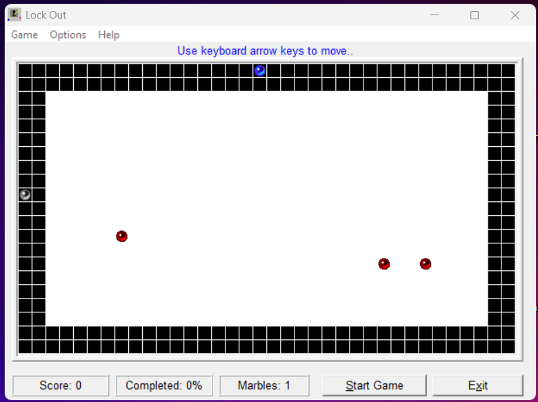

# Lock Out

A modern browser-based remake of the classic **Lock Out** mini-game from *Top 30 Games 4 Kids* (2001, Cosmi Corporation), originally programmed by Ron Paludan.

Lock Out is an **area-capture arcade game** inspired by titles like *JezzBall*, where players control a marble to claim territory while avoiding enemies.

    <em>The original version from Top 30 Games 4 Kids, Lock Out</em>

## Introduction

This project recreates the nostalgic Lock Out experience using **HTML5 Canvas, JavaScript, and CSS**, featuring:

- Smooth grid-based movement
- Dynamic enemy behavior
- Territory capture mechanics
- Retro-inspired UI with menus and modal dialogs

The goal is simple: **capture 75% of the board without losing all your marbles**.

## Features

- Classic area capture gameplay
- Player-controlled marble with smooth directional input
- Enemy marbles with collision detection
- Border marble hazard
- Score tracking and percentage completion
- Persistent high scores (localStorage)
- Difficulty levels (Beginner, Intermediate, Advanced)
- Pause/Resume functionality
- Retro Windows-style UI (menus, modals, buttons)

## Gameplay

- Move your blue marble across the grid
- Leave the border to start capturing territory
- Return safely to a wall to complete a capture
- **Avoid:**
  - Red enemy marbles
  - The silver border marble
  - Your own trail being hit

**Winning condition:**
- Capture **75% of the grid** to advance to the next level

**Losing condition:**
- Lose all marbles (lives)

## Installation

1. Clone or download the repository
2. Open `index.html` in your browser

> No build steps required

## Usage

- Launch the game by opening `index.html`
- Use the **Game menu → New Game** to begin
- Adjust difficulty via **Options menu**
- View high scores anytime

## Controls

| Action         | Key            |
|----------------|----------------|
| Move Up        | Arrow Up       |
| Move Down      | Arrow Down     |
| Move Left      | Arrow Left     |
| Move Right     | Arrow Right    |
| Pause / Resume | `P` or button  |

## Project Structure

### Core Files

- `index.html` - Main UI and layout  
- `globals.js` - Game constants and state management  
- `game.js` - Main loop, rendering, and game flow  
- `entities.js` - Player, enemies, and movement logic  
- `capture.js` - Flood-fill territory capture system  

### UI & Systems

- `menu.js` - Menu interactions and settings  
- `highscores.js` - Persistent leaderboard (localStorage)  

### Styling

- `layout.css` - Main layout and game window  
- `menu.css` - Dropdown menu styling  
- `modal.css` - Modal dialogs (About, High Scores)  

## Dependencies

This project uses **no external libraries**.

Built entirely with:
- HTML5
- CSS3
- Vanilla JavaScript (ES6)

## Troubleshooting

**Game not loading**
- Check file structure and paths
- Ensure all JS/CSS files are present

**Controls not working**
- Click inside the game window to focus
- Make sure the game is not paused

**High scores not saving**
- Ensure browser allows `localStorage`

**Sound not playing**
- Interact with the page first (browser autoplay policies)

## Acknowledgements

- **Original concept:** Top 30 Games 4 Kids (Cosmi Corporation, 2001)
- **Original programmer:** Ron Paludan
